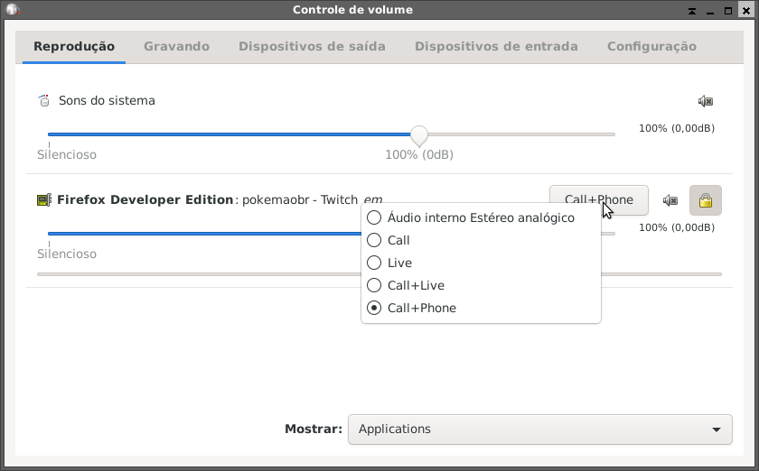

# PulseAudio for Live

Script para criar dispositivos no [PulseAudio](https://www.freedesktop.org/wiki/Software/PulseAudio/) para gerenciar o áudio dos programas do computador para lives e chamadas.

## Instalação

O palive pode ser instalado como um pacote do [Python](https://www.python.org/) através do [pip](https://pip.pypa.io/en/stable/), basta escolher a versão desejada na página de [releases](https://github.com/eduardoklosowski/palive/releases) e instalá-lo. Exemplos:

```sh
# Para instalar como um pacote Wheel
pip install palive-*.whl

# Para instalar como um pacote com o fonte
pip install palive-*.tar.gz
```

## Utilização

A instalação criará o comando `palive`, bastando executar `palive start` para criar os dispositivos e `palive stop` para removê-los. Caso existam mais de uma entrada de som no computador (microfone, por exemplo) ou saídas (placa de som, HDMI, fone USB...) o script perguntará qual delas será utilizada na configuração, bastando informar o número da interface listada na tela.

Após executar `palive start` algumas interfaces de áudio virtuais serão criadas, sendo elas:

- `Call`: Interface que envia o áudio do programa apenas para a chamada (Discord, por exemplo).
- `Live`: Interface que envia o áudio para a live (OBS, por exemplo) e fone de ouvido.
- `Call+Live`: Interface que envia o áudio para a chamada, live e fone de ouvido.
- `Call+Phone`: Interface que envia o áudio para a chamada, e fone, sem enviar para a live.

Esse comando também já associa alguns programas a determinadas saídas de áudio, como o [OBS](https://obsproject.com/) e o [Discord](https://discord.com/), podendo ser executador novamente para corrigir alguma alteração de configuração. E caso o programa tenha alguma configuração de áudio, deixe-a com o dispositivo padrão do sistema.

Para gerenciar qual programa deve enviar o áudio para qual saída, recomendo utilizar o [PulseAudio Volume Control](https://freedesktop.org/software/pulseaudio/pavucontrol/) (que pode ser instalado em sistemas Debian e derivados com `apt install pavucontrol`), utilizando a aba `Reprodução`:


